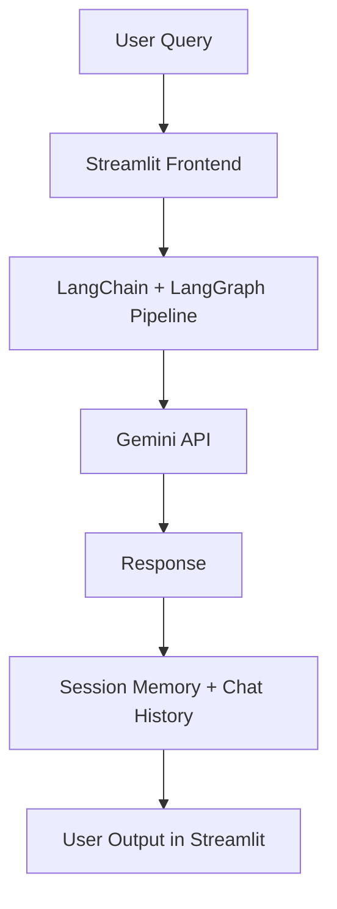

# 🤖 AI-Powered Agentic Chatbot

\*A complete agentic chatbot powered by **LangChain, LangGraph, Streamlit, and Gemini AI\***


---

## 🌟 Overview

This project is a **next-generation AI-powered agentic chatbot** built with **LangChain, LangGraph, Streamlit, and Gemini**.

Unlike typical chatbots, this one is **agentic**: it can leverage multiple tools, remember session history, and provide a **personalized and secure** conversational experience.

💡 _Think of it as your personal Gemini assistant — but with more control, memory, and local privacy._

---

## 🚀 Features

- 🔑 **Gemini API Integration** – Connect with Google Gemini for powerful generative AI
- 🛠️ **Multi-Tool Support** – Various tools dynamically appear after initialization
- 🧠 **Session Memory** – Chatbot remembers your session context for smooth conversations
- 🔒 **Privacy First** – Runs **locally** on your machine, ensuring **no data leakage**
- ⚡ **Error Handling** – Initializes even with invalid API key, then prompts for correction
- 💬 **Chat History Saved** – Retrieve previous interactions during your session
- 🎨 **Streamlit UI** – Clean, responsive, and interactive user interface
- 👨‍💻 **Customizable** – Extendable for **personal or enterprise-grade chatbot development**

---

## 🏗️ Architecture



---

## 📂 Project Structure

```
├── frontend.py           # Streamlit-based chatbot interface
├── backend/
│   └── agent_core.py     # Core LangChain + LangGraph logic
├── requirements.txt      # Dependencies
├── .env.example          # API key template
├── README.md             # Documentation
```

---

## 🔑 API Key Setup

This project uses **Google Gemini API**.

1. Get your **free Gemini API key** here: [Google AI Studio](https://makersuite.google.com/app/apikey)
2. When prompted by the chatbot, paste your key in.

   - Wrong key? → Chatbot still initializes but requests the correct key when you interact.

---

## 🛠️ Installation & Setup

```bash
# Clone repository
git clone https://github.com/adeelhamid/agentic-chatbot.git
cd agentic-chatbot

# Create environment
conda create -n agentbot python=3.10 -y
conda activate agentbot

# Install dependencies
pip install -r requirements.txt
```

Run the chatbot:

```bash
streamlit run frontend.py
```

## 📈 Future Enhancements

- 🔹 Multi-document understanding (PDFs, CSVs, URLs)
- 🔹 Vector DB integration (Pinecone, FAISS, Weaviate) for retrieval-augmented generation
- 🔹 Multi-agent orchestration (specialized reasoning agents)
- 🔹 Docker & CI/CD deployment pipelines

---

## 👨‍💻 Author

**Adeel Hamid** – _AI | Data Science | MLOps | GenAI Engineer_

🔗 [LinkedIn](https://www.linkedin.com/in/adeelhamid)
📧 Contact: [Portfolio & Info](https://adeelhamid.github.com)
🎥 YouTube: [@adeelhamid](https://www.youtube.com/@adeelhamid)

---

✨ _If you like this project, give it a ⭐ and follow for more AI projects!_

---

Do you want me to also **add a “🔧 How It Works (Step by Step)” section** explaining what happens from API key entry → tool initialization → chat memory → response generation, so recruiters can instantly understand the workflow?
